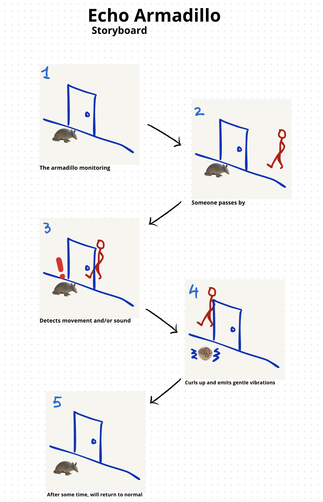

# Echo Armadillo
A soft robot resembling an armadillo, it detects movement and sound from the other side of the door. When it senses someone nearby, it curls up, signaling that your roommates are out of their rooms.

## Keywords
- alert
- shell
- protection
- movement
- sound
- aware
- friendly

## Summary
The device lets you know from the safety of your room if your roommates are nearby. When it detects a presence, the armadillo curls up, signaling it’s ‘not safe’ to step out yet. If no movement is detected for a while, you can confidently venture out. Over time, it may also help you understand your roommates's patterns, reducing continuous anxiety and making it easier to avoid unwanted encounters.

# Prototype

# Storyboard
