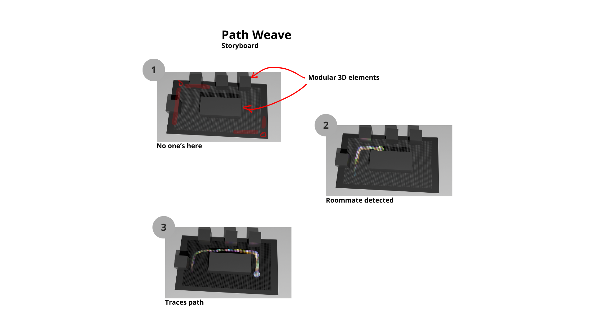

# Path Weave
An adaptable map that visually represents your living space, illuminating in real time the paths your roommates take, helping you stay informed about the occupancy of shared areas.

## Keywords
- pathway
- manifestation
- movement
- signal
- aware
- light
- activity

## Summary
The device is an adaptable map that is a physical representation of the common space in your flat. Motion sensors linked to the map are placed throughout the shared areas to track your roommates' movements. In real time, the map illuminates their paths, with the brightest coordinates indicating where each person was last located. As time passes, the light gradually dims, creating a dynamic visualization of activity in the flat. This interactive feature helps you stay informed about when your roommates are out of their rooms, allowing you to venture forth with ease and avoid unexpected encounters.

# Prototype

# Storyboard
