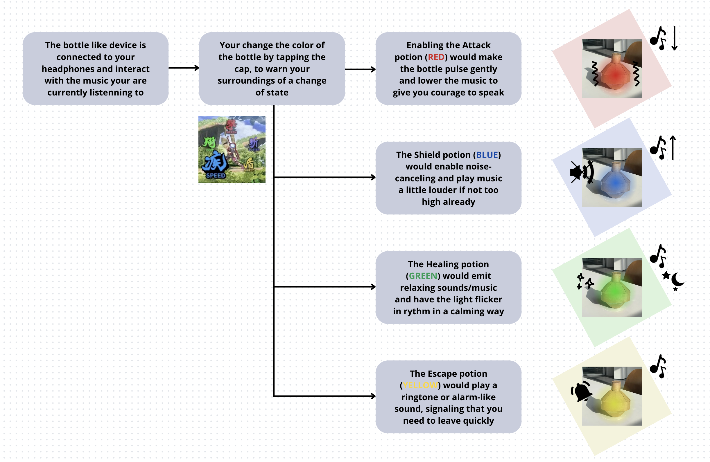

# RPG bot
A metaphor of social interactions navigation in shared living spaces. It shape-shifts through 4 forms : 
-Attack, allowing you to transform conflict or avoidance into connection, making interaction easier when you're ready for it.
-Shield, avoiding detection, create space for privacy.
-Heal, that permits you to recharge your social battery, regain mental peace.
-Escape, allows safe retreat from uncomfortable situations or unwanted interactions.

## Keywords
- confrontation
- protection
- shelter
- soften
- retreat

## Summary
To summarize, with 'RPG Bot,' you’ll be able to shift modes based on the situation and follow your needs. The device will listen and support you in replenishing yourself, avoiding interaction, confronting others, or escaping in urgent situations—just like action commands in a role-playing game.
The bottle-like robot, connected to your headset, would change color to signal your current need to others, which you could adjust by pressing it. 'Attack' (red) would pulse gently to give you courage to speak, 'Shield' (blue) would enable noise-canceling and play music, and 'Healing' (green) would emit relaxing sounds/music and have the light flicker in rythm in a calming way, calming light flicker. Finally, 'Escape' (yellow) would play a ringtone or alarm-like sound, signaling that you need to leave quickly.

# Prototype

# Storyboard
