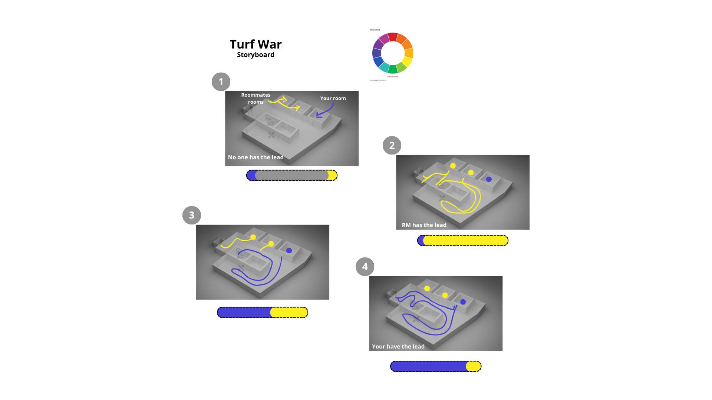

# Turf War
A device designed to help users build up the courage to step out of their room by visualy representing their marked territory in shared spaces.

## Keywords
- courage
- defiance
- movement
- color
- territory

## Summary
In essence, it’s a gauge-like device that visually tracks which presence prevails in shared spaces, encouraging the user to step out and tip the scale to their advantage. Movement trackers connected to the device are scattered around the shared space and update in real-time to display activity whenever your roommates are out of their rooms. The more you occupy the common areas, the more the device reflects your color on the gauge.
# Prototype

# Storyboard
