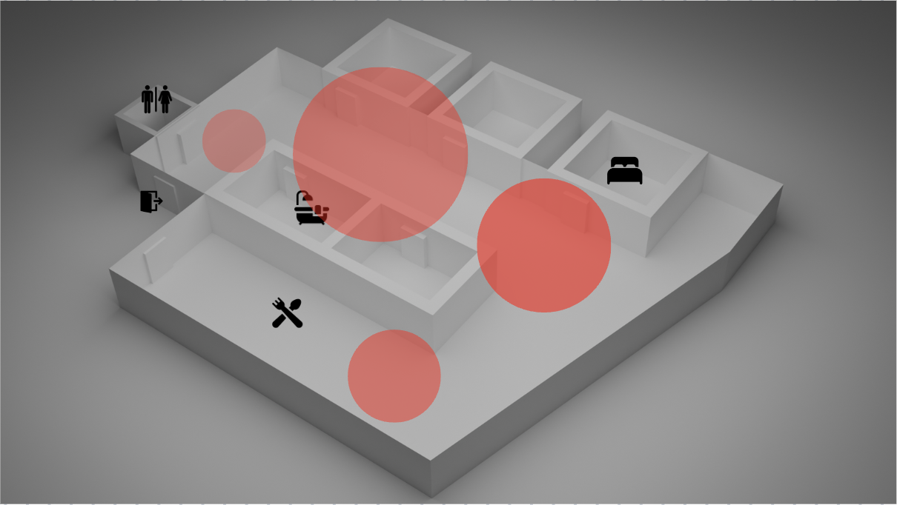
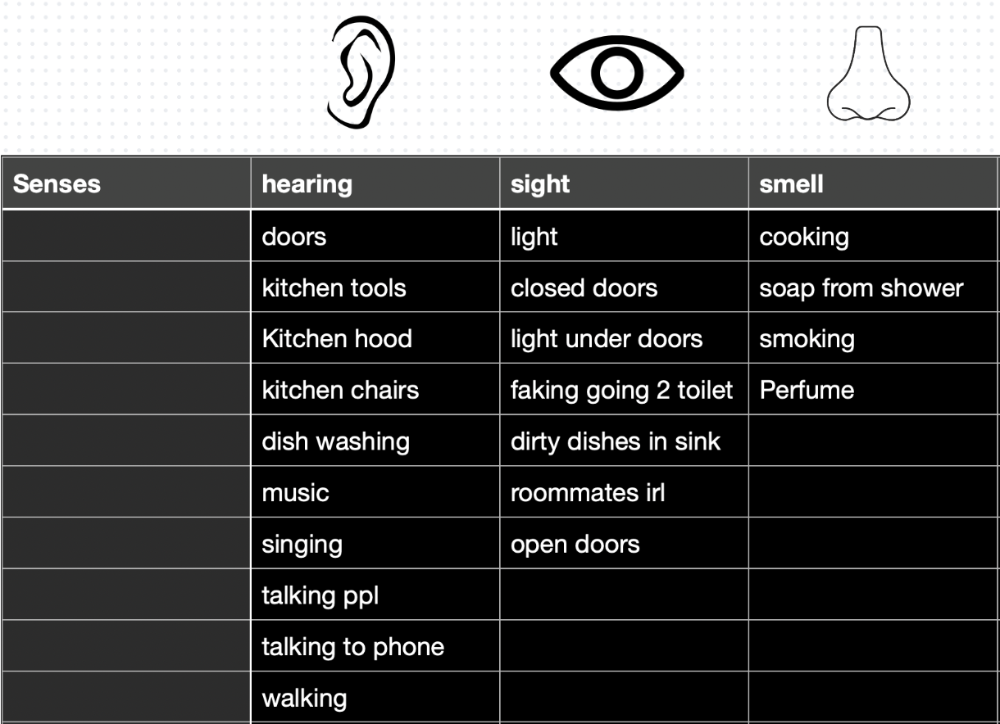
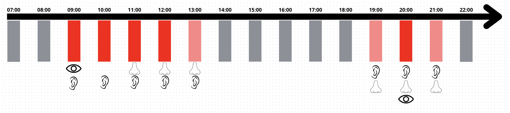
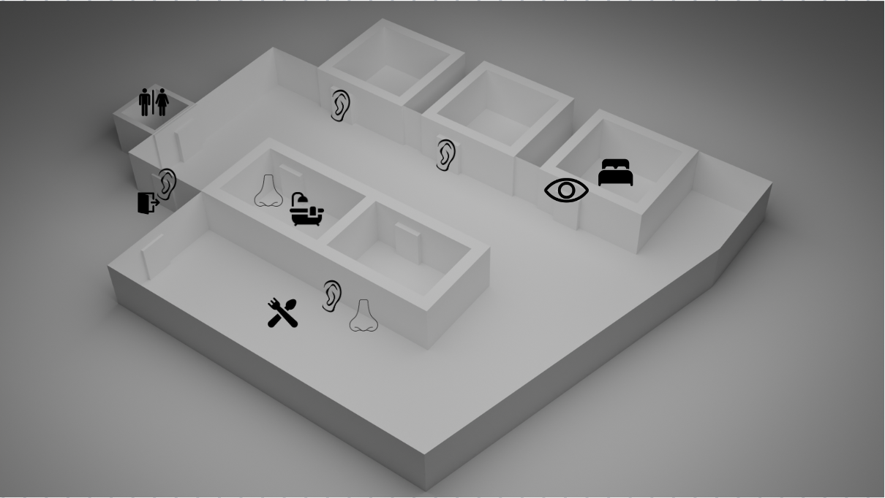
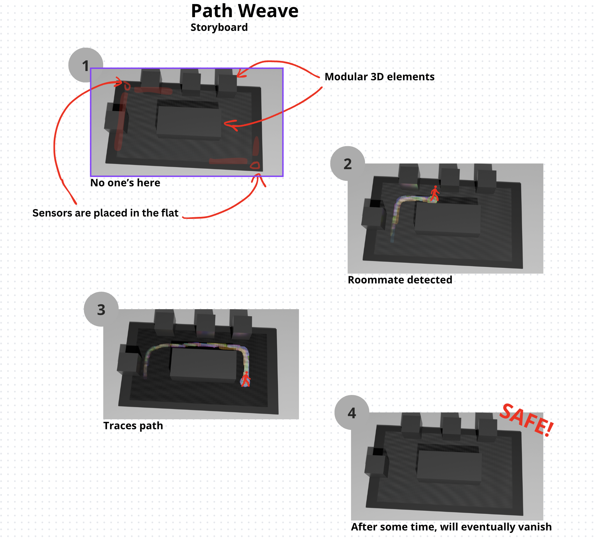
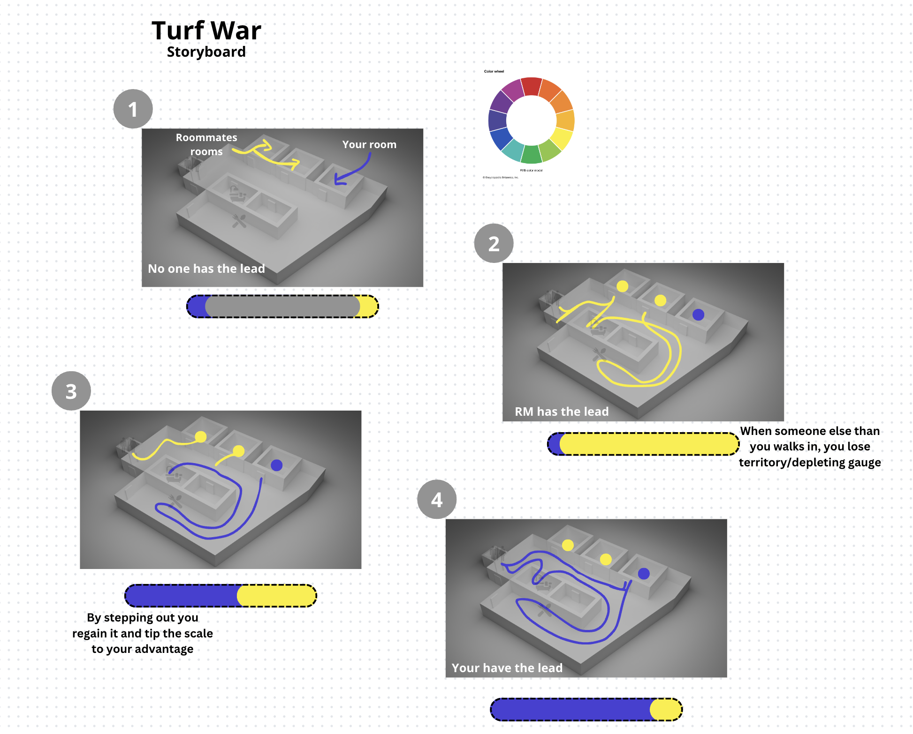
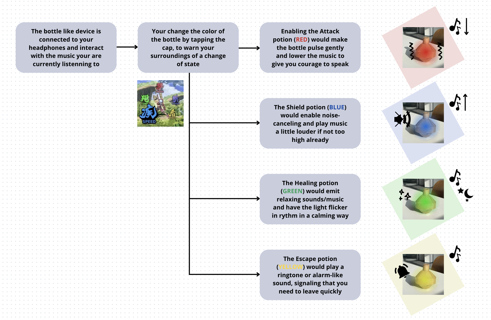

# Ayoub
- Soft Robots
- Master Media Design + O2R

## Area of intervention
Social avoidance strategies in a shared collective living space.

## Research Question
How can I relieve myself from potential encounters in our shared flat?

## Research
When I started working on my living space, I quickly connected it to the fact that I live in a shared flat and realized how much I try to avoid my roommates. This led me to observe my daily avoidance tactics in greater detail.

Observation of my daily avoidance tactics:

- Noting the techniques I employ to avoid interaction, like avoiding eye contact, wearing headphones, pretending to go to the bathroom, or quietly staying in my room.
- Listing the different senses I rely on throughout the day, such as sight, hearing, and smell.

- Creating a timeline to track which senses I use at specific times, identifying patterns and moments of heightened awareness.

- Mapping my flat to identify the riskiest areas, based on my roommates' paths compared to mine, and pinpointing where my senses come into play to avoid contact.

## Insights
Random encounters make everything more stressful.
Gamifying shared spaces encourages taking action.

## First ideas & prototypes

### Path Weave
The device is a customizable map of your flat’s common spaces. Motion sensors track roommates' movements, lighting up paths in real-time with the brightest spots showing recent locations. As lights fade, you get a dynamic view of activity, helping you avoid unexpected encounters

### Turf War
In essence, it's a gauge-like device that reflects which presence prevails in shared spaces, encouraging the user to step out and tip the scale to their advantage. Movement trackers update in real-time, displaying the color that triumphs between you and your roommates.

### Role Playing Rythm
Switch modes to fit your needs, recharge, avoid, confront, or escape similarly to command actions in an RPG. The bottle-like robot syncs with your headset and shifts color to signal your mode. ‘Attack’ (red) lowers music and pulses to encourage you to talk; ‘Shield’ (blue) boosts music and enables noise-canceling; ‘Heal’ (green) plays relaxing music and flickers gently; ‘Escape’ (yellow) cues an alert to exit.

## Next Steps
Focus more on gameplay aspects to expand the playful elements of the different prototypes. And then go back to the physical thing.