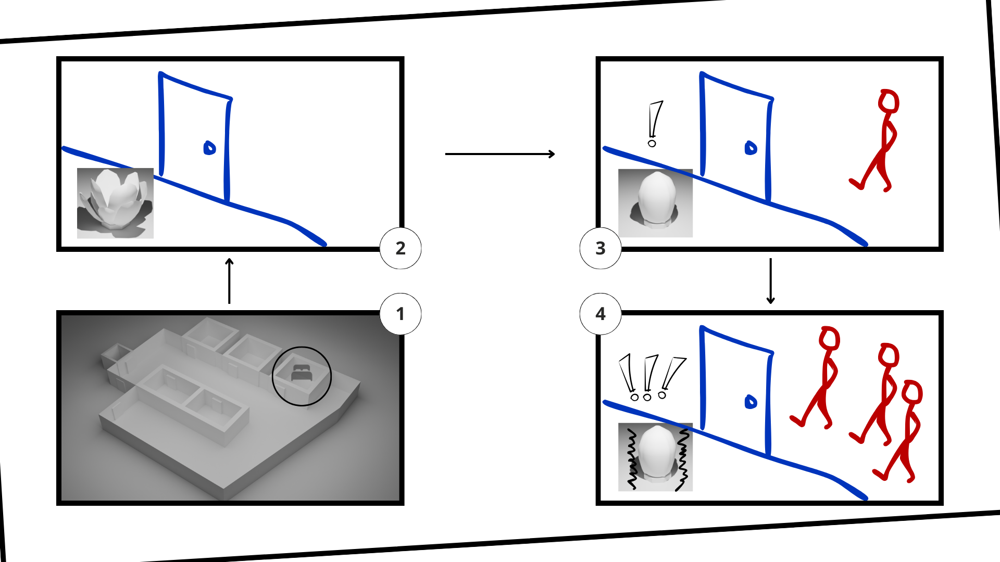

# Ayoub
- Soft Robots
- Master Media Design + O2R

## Whispers
How can I relieve myself from potential encounters with my roommates in our shared flat? How can I avoir them when I feel like I dont want to see them

## Pitch
My flower device signals if roommates are in shared spaces, it closes when detected, vibrates for crowds.

## Prototyping research
I first explored various opening mechanisms to metaphorize states of safety and danger, starting with a flower and experimenting with more abstract designs. I also studied how fruits peel or open. Ultimately, I returned to the flower prototype, as it resonated most with the people I showed it to. I attempted to make it functional with Arduino but faced challenges converting circular motion into linear movement. Finally, I got back to pencil and paper, creating a design resembling a lotus flower.

## Your key prototype
My project is a flower-like device that alerts me if my roommates are in the shared space. Each room could have a device resembling a flower. It remains naturally open but closes when someone is detected outside. If more than two people (matching the number of my roommates) are detected, it vibrates to alert me of a greater threat.

+ One 3D image 
+ (Optional) Audio
+ (Optional) Video

## User scenario

## Next Steps
In one sentence, describe what you will focus on next.