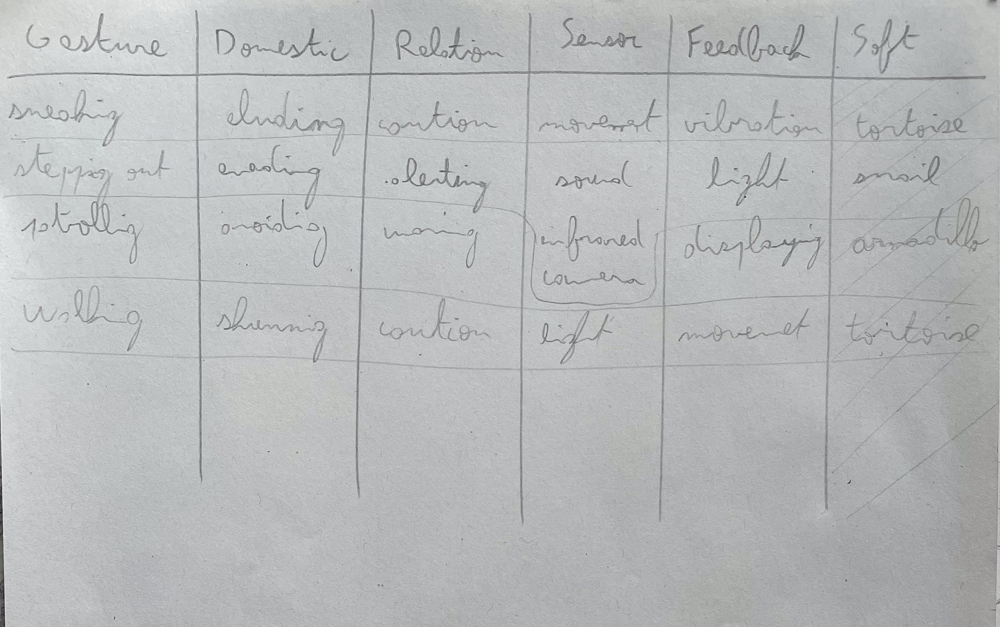

# Reaserch on concrete concepts

# Pictures of todays research

# Chat GPT exchanges

# About the physical form of RPG Soft Robot
For a **soft robot** that aligns with your RPG-inspired concept, the design and interactions would need to feel intuitive, non-intrusive, and physically adaptable to different social scenarios. Soft robotics, with their flexible, human-friendly materials and behaviors, are perfect for this context—offering a **blend of subtle sensory input and environmental shaping**.

Here’s how each element could be applied to a **soft robot**:

---

### **Physical Form and Design:**
1. **Shape:**  
   The robot could take on an amorphous, flexible shape like a **cushion, blob, or modular "cloud-like" form** that can subtly shift between roles. This allows it to transform based on your current needs (e.g., expanding to create boundaries, shrinking to conserve space, or changing texture to provide comfort).
   
2. **Mobility:**  
   It could be **stationary** (like a living room cushion) that interacts passively, or **mobile** (using soft actuators, like the "soft tentacles" used in some soft robotics, to crawl or roll from room to room). It could even **inflate or deflate** certain parts to physically expand or contract.

3. **Tactility:**  
   Its surface could be **smooth and soft to the touch** with **skin-like materials** (e.g., silicone or soft fabric) that encourage interaction and comfort when held or squeezed. This would create a **soothing, non-threatening presence**, allowing the robot to feel like a comforting companion.

4. **Appearance:**  
   It would have an **adaptive, abstract design** with no clear face, allowing it to be present without giving the feeling of being “watched.” This makes it less intimidating and easier to accept in social settings.

---

### **Interactions and Inputs:**
1. **Movement/Proximity Detection:**
   The robot would rely on **sensors** such as **infrared, ultrasonic, or LIDAR** to track the movement and proximity of people in your space (roommates walking past the door, entering the kitchen, etc.). This allows it to react based on how near or far people are, adjusting its behavior accordingly.

2. **Sound Input:**
   It could use **microphones** to detect nearby conversation, music, or the activity level (e.g., dishwashing sounds, footsteps). It would differentiate between **human voices, footsteps, and other noises** and adapt its response (either alerting you or suggesting interaction, depending on the mode).

3. **Emotional Inputs (User Mood):**
   You could **input your mood** or **intentions manually** through a simple **touch interface** or **mobile app** (e.g., selecting “Shield” or “Attack” mode). It could also include a **wearable sensor** that detects your stress levels through heart rate or other bio-signals, prompting the robot to change modes automatically if it senses you're feeling overwhelmed.

---

### **Possible Outputs:**
1. **Attack Mode 🗡️** – Social Connection:
   - **Outputs:**
     - The robot could produce **gentle, pulsing light** or soft musical tones to signal an openness to social interaction.
     - It might **send text or voice messages** through a connected app, inviting roommates to a conversation or even suggesting shared activities.
     - Its surface might become **soft and warm**, encouraging physical proximity (like sitting on it) and reducing tension in social spaces.
   
   - **Interaction:** You could touch the robot to "activate" it for social interaction, and it would then signal to your roommates through sound/light that you're ready for connection, reducing social barriers.
   
2. **Shield Mode 🛡️** – Avoidance and Privacy:
   - **Outputs:**
     - The robot would generate **soft environmental masking** (e.g., white noise or ambient sounds) to cover up the noise you're making or alert you when someone is approaching.
     - It could **physically expand** (inflate) or **shift its form** to create a subtle boundary between you and others, like a barrier between a door or seating area.
     - It might **dim the lights** around it or give off a **low visual signal** (e.g., a soft red glow outside your door) to indicate to others that you're in “privacy mode.”
   
   - **Interaction:** You could "hug" or press the robot to activate the Shield, which would immediately start its masking or boundary-building actions.
   
3. **Heal Mode ⚕️** – Recharging Social Battery:
   - **Outputs:**
     - The robot creates a **calming atmosphere**: soft lights, rhythmic vibrations, or soundscapes (like ocean waves, wind, or soothing music) to help you recharge.
     - It might initiate a **guided breathing exercise** or **meditation** through auditory or visual cues, helping to slow your heart rate and reduce stress.
     - The robot could **adjust its texture or temperature** to a more comforting, plush feel when you're sitting or lying near it.
   
   - **Interaction:** You might sit close to or hold the robot, and it would intuitively sense when to begin calming actions. You could also press certain areas to increase or decrease the intensity of the soothing outputs (vibrations, lights, etc.).
   
4. **Escape Mode 🏃💨** – Evasive Action:
   - **Outputs:**
     - The robot could **scout the environment** using its movement sensors and suggest the best time or route for you to leave a room unnoticed. It might vibrate gently or give **haptic feedback** to let you know the coast is clear.
     - It could create a **distraction**, such as turning on a kitchen appliance or playing music, to draw attention away from your exit.
     - The robot might **deflate** or **shrink** to be easily carried with you, or it could give you a tactile guide to avoid other roommates.
   
   - **Interaction:** When in escape mode, you’d interact with the robot via touch or voice to plan the exit. It could give you subtle, **vibrational hints** through a wearable or itself on when the path is clear.

---

### **Summary of Inputs and Outputs:**
- **Inputs:**
  - **Movement detection:** People walking near or entering shared spaces.
  - **Sound detection:** Voices, footsteps, and kitchen or bathroom noises.
  - **Touch/Manual input:** User selects mode (Attack, Shield, Heal, Escape) via robot touch interface or mobile app.
  - **Bio-signals (optional):** Heart rate, stress levels, or emotional inputs through a wearable sensor.

- **Outputs:**
  - **Visual cues:** Light changes (dimming, pulsing, or color shifts), projected signals, and physical form shifts (inflating/deflating).
  - **Sound cues:** Ambient noise, white noise, or calming soundscapes.
  - **Vibration and haptic feedback:** Subtle vibrations to signal timing or directions (especially in Escape mode).
  - **Physical gestures:** The robot could expand, shrink, or gently guide you using tactile feedback, creating a soft, fluid barrier or comfort space.

---

### Interaction Flow Example:
**You’re in your room, feeling socially drained and needing to avoid roommates.**
1. The robot detects movement outside your door (via sound or movement sensors).
2. You press the robot softly, activating **Shield Mode**. The lights dim, and the robot inflates slightly, creating a subtle barrier between you and the shared space.
3. After resting for a while, you feel ready to engage in a light conversation. You tap the robot again, switching it to **Attack Mode**. It sends a soft social cue (like a light pulse) that lets your roommates know you’re open to a chat.
4. When you're done socializing, the robot helps you wind down with **Heal Mode**, playing soft music and dimming the lights to help you recharge.

---

This setup creates a soft robot that **dynamically adapts** to your social needs, embodying the RPG-style actions with subtle, sensory feedback loops. Would you like to refine any of these ideas further?

# New Map Soft Robot

## Question
I have a new concept, tis a flat surface that may look like a screen on which there is a lot of led's displayed, and captors are placed all around the apartment's common space so it kinda map the whole space and when movement is detected, led's close to the detected coordinates lights up and traces the path of the movement (like someone walking in the flat). Do you need more details or should I explain the whole thing in a better way?

## Answer
I think I get the general idea—it sounds like a **map-like display** that visually represents movement throughout the apartment in real-time. Here's how I understand it so far:

- **Flat Surface (Screen-like):** This surface displays LED lights across a grid.
- **LED Mapping:** Each LED corresponds to a specific area in the apartment.
- **Sensors Throughout Common Spaces:** These sensors (like motion detectors) track movement, feeding data to the display.
- **Movement Tracing:** As a person moves through the apartment, the LEDs light up to show their path across the map, creating a visual trace of their movements in real-time.

This is a clever concept for seeing when and where people are moving without physically encountering them. Let me know if I missed any important details or if there’s more about how you imagine the design working (e.g., colors, range, or special behaviors like dimming over time).