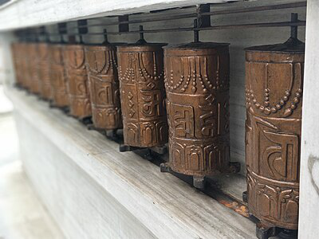

# Last week's research

## I continued researching different concepts

I continued exploring various ways to represent a gauge.

Here I got inspired by prayer wheels usualy tied to buddhism.

Then, I continued exploring designs that might be less conventional. And I worked on incorporating a third state more prominently, even by introducing a new color.

At one point, I revisited the opening and closing mechanism, drawing inspiration from fruits and how they unfold.

In the end, I focused on the opening mechanism and returned to the flower design.

## The flower
It’s a flower assigned to each individual’s room, connected to a sensor in the common space. When the sensor detects movement or Bluetooth signals from smartphones, it sends a signal to the flower, causing it to close as an alert that someone is in the shared space. When the area is empty, the flower reopens, signaling that it’s safe to wander around. If more than two people (matching the number of my roommates) are detected, the flower closes and vibrates to emphasize a greater threat. The sensor in the common space could resemble a sun-like lamp, symbolizing photosynthesis in its communication with the flowers in our rooms.

## Arduino and more

We also started working with Arduino and experimented with various components, including lights, temperature and humidity sensors, LCDs, and motor controllers.

Having the opportunity to visit l'Écal during the training to research module, I was able to explore the school and see student projects that could inspire me.

