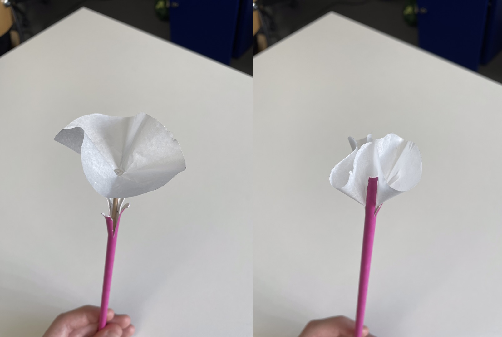

# Where to go now?

After the presentation on December 4th, I received feedback that led me to pursue the prototype "Calystegia".

It resembles more of a soft robot than the lotus flower in the way that it seems more fragile and could be linked to the constraint of having a hard time dealing with social anxiety, and having a flower that tries to protect itself in a sort of shell.

## How to procede
+ Scenario
+ Location/phisicality
+ Size (cause of electronics and placement)
+ RNG?! (personality?)

Pictures of possible placements in a room

## Scenario

Each habitent of the flat hs a flower in their room
option 1 :
Each flower reacts the same (closes when detecting movement, opens when not)
option 2 :
Depending on your desires it could be different, have different meanings (opening when people are nearby and closing when not)

The motion sensor is outside of the room (connected by wifi) and should probably be desgised.

Perhaps the flowers could comunicate in a way to add interactivity/rng/unstallness like the talking to get more acurate data thing.

## Location in the room and how it stands

Could be on your desk or bedside table or even on the wall

Pictures of how to hang (myself) a flower on the wall or next to it

Pictures to have a single flower in a recepient (vase)

## Interactions

To add interactivity the user could have a more prominent role by having a impact on the data the motion sensor gets.
Like for example talking to the flower to get more acurate info.
+ sound based control (voice)
+ touching/tapping
+ motion sensor, making movement to comunicate
+ 