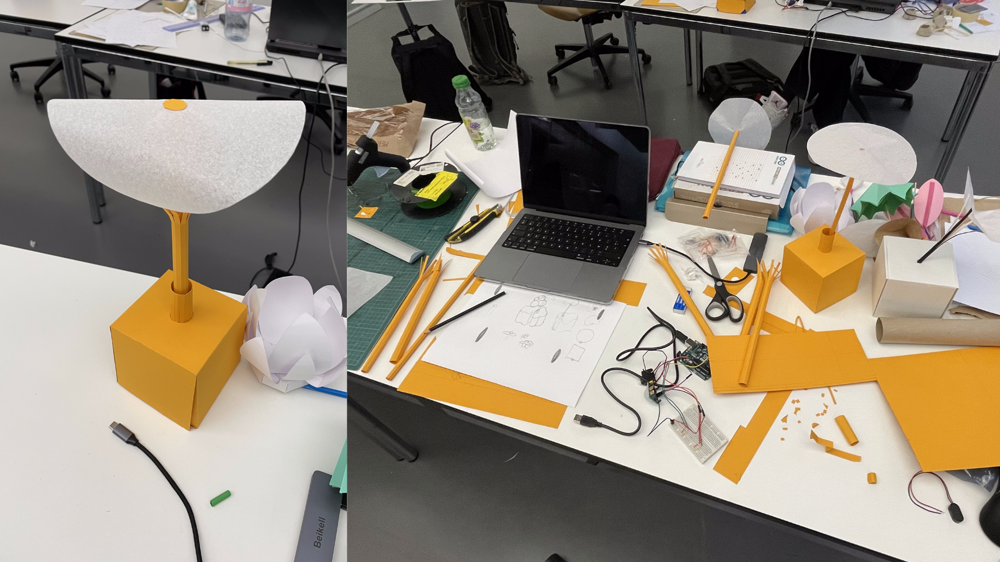

## Base of the Calystegia

Over the past few days, I conducted research and tests on the form of the object. I am currently exploring ways to move beyond a simple cube shaped design for the base that will hold the flower.

I needed something softer and more in line with the flower-like object to serve as both a base and storage space for the electronics (Arduino, servo motor, motion sensor). I took pictures of possible formations that the soft part of the object could take, allowing me to convert them into 2D to explore potential design ideas from a topdown perspective.

